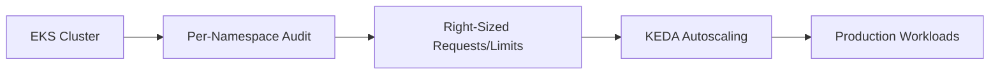

## Summary

This ADR documents the strategy used to resolve a cluster-wide resource quota overcommit on a multi-tenant AWS EKS platform running 500+ Kubernetes deployments, without pausing continuous software delivery.

## Problem

Aggregate cluster metrics looked healthy, but capacity allocation across 100+ namespaces had drifted from actual usage over time. The overcommit was invisible at the cluster level and only became traceable once usage was audited per namespace.

## Decision

Audit resource requests and limits per namespace against real usage, then right-size allocation tenant by tenant — rather than applying a single cluster-wide capacity adjustment.

## Trade-offs

| Option | Pros | Cons |
|---|---|---|
| Cluster-wide capacity bump | Fast to apply | Masks the overcommit, resurfaces as the platform grows |
| Per-namespace right-sizing (chosen) | Fixes the actual source, durable | Slower, requires auditing 100+ namespaces individually |

Per-namespace right-sizing was chosen because a blanket fix would have hidden the same overcommit reappearing at the next growth stage, not resolved it.

## Lessons Learned

Resource overcommit in a multi-tenant cluster hides in aggregate metrics — the cluster can report healthy while individual namespaces are already over-allocated. Tracing the problem to its source per namespace was slower than a blanket fix, but it was the version of the fix that actually held.
