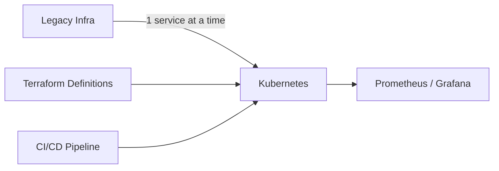

## Summary

This ADR documents the strategy used to migrate a 200+ microservices platform from legacy infrastructure to a cloud-native environment on AWS and Kubernetes, without service interruption.

## Problem

The existing infrastructure was managed manually, with configuration drift between environments and no reliable way to reproduce production from source. Every deployment carried avoidable risk.

## Decision

Migrate incrementally, service by service, with infrastructure defined in Terraform before any workload moves, and CI/CD as the only path to production.

## Trade-offs

| Option | Pros | Cons |
|---|---|---|
| Big-bang cutover | Faster overall | High blast radius, hard rollback |
| Incremental migration (chosen) | Isolated risk, easy rollback | Slower, requires dual-running |

Incremental migration was chosen because zero downtime was a hard requirement and the team size (3 engineers) made a single high-stakes cutover too risky to operate.

## Lessons Learned

The value of Infrastructure as Code showed up most clearly the first time an environment needed to be rebuilt from scratch — at that point, the Terraform definitions were the actual source of truth, not a document describing what production was supposed to look like.
