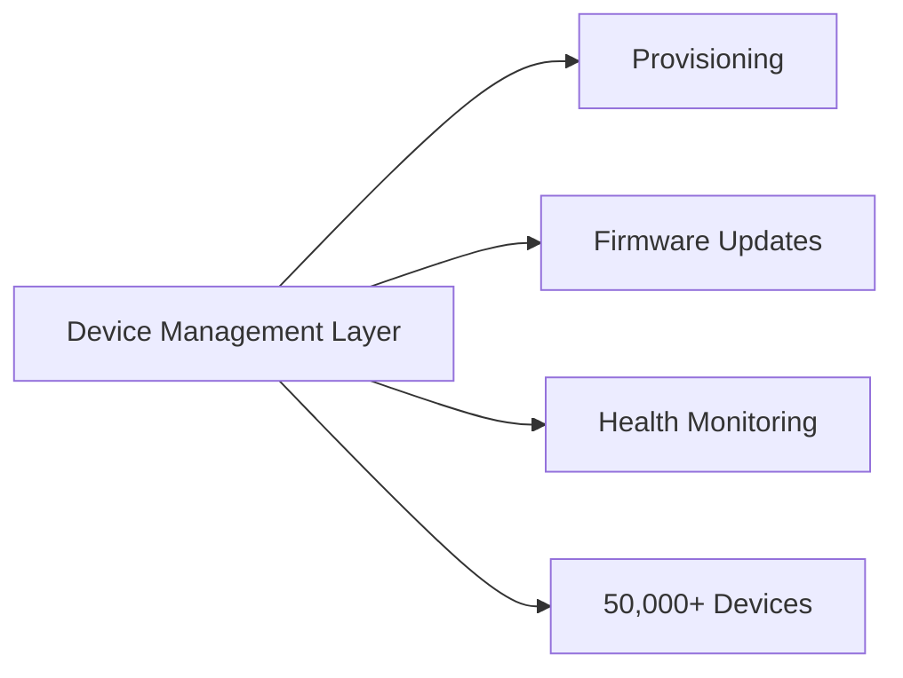

## Summary

This ADR explains the decision to build a centralized device-management layer rather than operating IoT devices on a per-site, per-installation basis.

## Problem

With a two-person architecture team and a fleet growing toward 50,000+ devices, treating each site as an independent deployment would have made operations impossible to scale. Fleet-wide visibility and control needed to be a platform capability, not a manual process.

## Decision

Build a centralized device-management system that treats every device as part of one fleet — provisioning, firmware updates, and health monitoring are managed centrally and pushed out, not configured per site.

## Trade-offs

| Option | Pros | Cons |
|---|---|---|
| Per-site management | Simple for small deployments | Does not scale past a handful of sites |
| Centralized fleet management (chosen) | Scales to tens of thousands of devices | Higher upfront design cost |

## Lessons Learned

The upfront investment in a fleet-management abstraction paid for itself well before reaching 50,000 devices — the alternative would have required linear growth in operations headcount, which was never on the table with a two-engineer team.

See the related case study: [Smart City IoT Platform](/work/smart-city-iot-platform).
