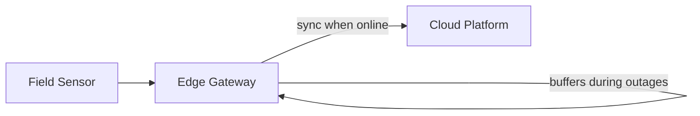

## Summary

This ADR covers the decision to process telemetry at the edge rather than relying solely on a centralized cloud pipeline for a smart-city IoT deployment.

## Problem

Field devices — traffic signals, environmental sensors, waste-management systems — were distributed across many locations with connectivity that could not be assumed to be constant. A cloud-only design would lose data during any network interruption.

## Decision

Process and buffer telemetry locally at edge gateways, syncing to the cloud platform when connectivity allows, rather than requiring devices to stream continuously to a central endpoint.

## Trade-offs

| Option | Pros | Cons |
|---|---|---|
| Cloud-only ingestion | Simpler architecture | Data loss during connectivity gaps |
| Edge processing (chosen) | Resilient to intermittent connectivity | More components to secure and operate |

## Lessons Learned

Designing for network unreliability from the outset was far cheaper than retrofitting buffering and replay logic after a data-loss incident. The edge layer became the natural place to enforce device authentication and encryption as well, since it was already a trust boundary.
