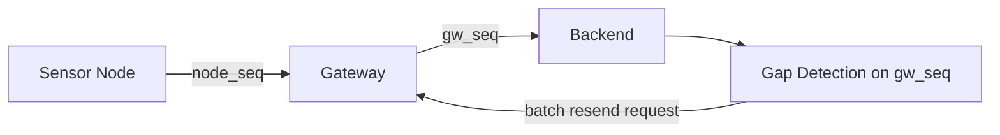

## Summary

This ADR documents the decision to track two independent sequence counters — node-to-gateway and gateway-to-backend — so that only recoverable data loss gets treated as recoverable.

## Problem

Telemetry frames can be lost at two different points: between the sensor node and the gateway (RF loss), or between the gateway and the backend (uplink loss). A single "missing data" signal can't distinguish between them, but only one of the two is actually recoverable after the fact.

## Decision

Track `node_seq` (RF transmission, node → gateway) and `gw_seq` (uplink delivery, gateway → backend) as two separate counters. A self-healing job detects gaps specifically in `gw_seq` and requests exactly those missing sequences from the gateway in a single batched command over MQTT.

## Trade-offs

| Option | Pros | Cons |
|---|---|---|
| Single "missing data" counter | Simpler to implement | Can't tell recoverable gaps from unrecoverable RF loss |
| Two independent counters (chosen) | Recovery only attempted where it can succeed | Requires gateways to track and expose both counters |

Batched recovery requests were chosen over per-sequence requests because requesting sequences individually caused each read to scan the gateway's full on-device log and produced collision errors — a constraint of the firmware, not the backend's data model.

## Lessons Learned

The recovery mechanism only works because the failure mode it's built for is real: attempting to recover RF loss between node and gateway would fail every time, since those frames never reached the gateway's log to begin with. Modeling the two loss points separately is what made it possible to know, in advance, whether a given gap was worth trying to recover.
