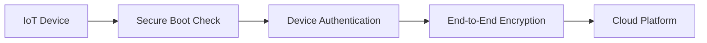

## Summary

This ADR covers the security model applied to a fleet of IoT devices controlling public infrastructure, where compromised devices carry real-world consequences.

## Problem

Devices controlling traffic signals and environmental sensors are physically accessible and network-connected — an attractive and realistic attack surface. Security could not be treated as a hardening pass applied after launch.

## Decision

Build security in as three layers applied to every device: end-to-end encryption for all traffic, unique per-device authentication credentials, and secure boot to reject tampered firmware.

## Trade-offs

| Option | Pros | Cons |
|---|---|---|
| Security as a later hardening pass | Faster initial delivery | Retrofitting auth/encryption across 50,000+ devices is far costlier |
| Security by design (chosen) | Consistent posture across the fleet | Higher upfront implementation cost per device |

## Lessons Learned

Every device that joined the fleet after the framework was in place inherited the same security posture automatically, which would not have been true if authentication and encryption had been added device-by-device after the fact.

See the related case study: [Smart City IoT Platform](/work/smart-city-iot-platform).
