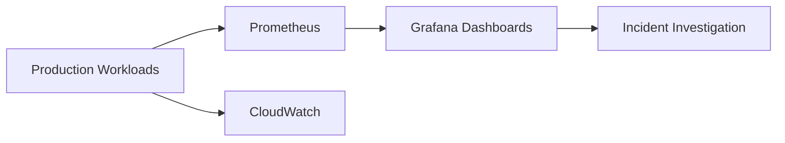

## Summary

This ADR documents the observability and incident-management practices used to investigate and resolve production incidents across the multi-tenant EKS platform at TicketSocket.

## Problem

Distributed systems, databases, networking, and cloud infrastructure all contribute to production incidents on a multi-tenant platform. Without a consistent monitoring baseline, root-causing an incident depends on whoever is on call already knowing the specific workload involved.

## Decision

Standardize on Prometheus, Grafana, and CloudWatch as the monitoring stack across the platform, so every workload exposes metrics the same way regardless of which tenant or team owns it.

## Trade-offs

| Option | Pros | Cons |
|---|---|---|
| Per-team monitoring tools | Flexible per team | Inconsistent, hard to reason about system-wide |
| Standardized stack (chosen) | Consistent incident response across tenants | Requires migration effort per workload |

## Lessons Learned

Complex production incidents that cross distributed systems, databases, networking, and infrastructure boundaries get resolved faster when the investigation doesn't start with "which team owns this and how do I read their dashboards." A consistent stack turns that into a non-question.
