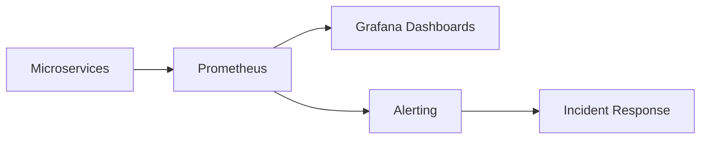

## Summary

This ADR documents the observability and incident-management practices established alongside the cloud-native migration at Halo Media.

## Problem

Prior to the migration, incident response depended heavily on individual engineers' familiarity with specific services. There was no consistent monitoring baseline across the 200+ microservices environment, which made root-causing incidents slow and inconsistent.

## Decision

Establish Prometheus and Grafana as the standard monitoring stack for every service migrating to Kubernetes, paired with documented incident-response practices and consistent version-control conventions.

## Trade-offs

| Option | Pros | Cons |
|---|---|---|
| Per-service monitoring tools | Flexible per team | Inconsistent, hard to reason about system-wide |
| Standardized stack (chosen) | Consistent incident response | Requires migration effort per service |

## Lessons Learned

Downtime dropped by 30% not because of a single tool, but because every service exposed metrics the same way — engineers on call no longer needed prior familiarity with a specific service to start diagnosing an incident.
