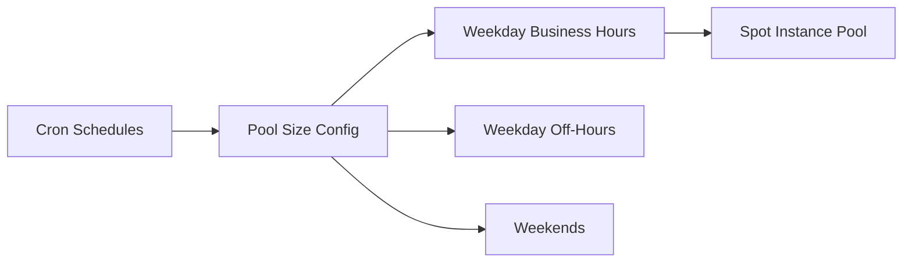

## Summary

This ADR documents the decision to size the self-hosted GitHub Actions runner pool by time-of-day and day-of-week schedule, instead of running a fixed-size fleet.

## Problem

CI demand is heavily time-dependent — weekday business hours generate far more concurrent jobs than nights and weekends. A fixed-size runner fleet is either underprovisioned during peak hours (long queue times) or wastefully oversized the rest of the time.

## Decision

Define pool size per cron schedule — weekday business hours, weekday off-hours, and weekends each get an independently configured target pool size — using the runner module's scheduled pool configuration, backed by ephemeral spot instances.

## Trade-offs

| Option | Pros | Cons |
|---|---|---|
| Fixed-size fleet | Simple to configure | Underprovisioned at peak or wasteful off-peak |
| Schedule-aware pooling (chosen) | Capacity follows real demand | Requires tuning schedules as usage patterns shift |

## Lessons Learned

The schedules aren't set-and-forget — they need to track actual usage patterns as team size and CI habits change. The win isn't just cost; queue time during peak hours is a direct developer-experience cost that a fixed fleet either overpays to avoid or accepts as a tax on every peak-hour build.
