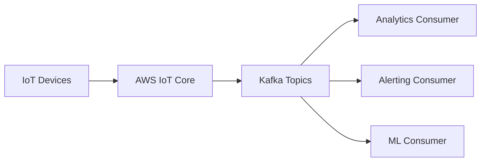

## Summary

This ADR documents the decision to introduce Apache Kafka as a decoupling layer between device telemetry ingestion and downstream analytics.

## Problem

Telemetry from tens of thousands of devices needed to feed multiple downstream consumers — analytics dashboards, alerting, predictive-maintenance models — each evolving on its own schedule. A direct point-to-point integration would have coupled ingestion to every consumer's availability and pace of change.

## Decision

Route device telemetry through AWS IoT Core into Kafka topics, with independent Lambda consumers per downstream use case.

## Trade-offs

| Option | Pros | Cons |
|---|---|---|
| Direct integration per consumer | Simple for one consumer | Couples ingestion to every consumer's uptime |
| Kafka as a decoupling layer (chosen) | Independent scaling, replay support | Additional operational component |

## Lessons Learned

The decoupling paid off the first time a new downstream use case (predictive maintenance) was added without touching the ingestion path at all. Replay support in Kafka also proved valuable for backfilling analytics after a downstream bug — data wasn't lost, it was just reprocessed.
