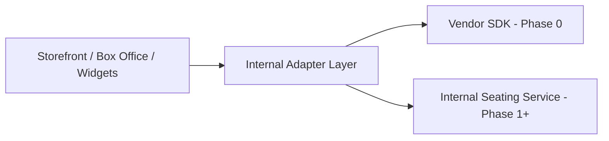

## Summary

This ADR documents the strategy for replacing a third-party seating vendor that is integrated across storefront, box office, customer accounts, and widget surfaces, without rewriting those surfaces around a new domain model.

## Problem

The vendor's SDK and renderer concepts are referenced directly across multiple product surfaces. A full replacement's true scope — seated maps, season events, chart designer, large venues, channels — is large enough that attempting it as one delivery would either take too long to ship any value or force every calling surface to change at once.

## Decision

Build the replacement behind the platform's existing integration boundary, so callers move from vendor SDK concepts to internal DTOs through adapters — and roll it out in phases ordered by risk: general admission and single events first, seated maps and season events later.

## Trade-offs

| Option | Pros | Cons |
|---|---|---|
| Full rewrite across all surfaces | Clean new domain model from day one | High risk, long time to any shipped value |
| Adapter-based, phased replacement (chosen) | Callers keep working throughout, risk-ordered rollout | Adapters add a translation layer that outlives the migration |

Phased, adapter-based replacement was chosen because concurrency correctness for seat holds and bookings is revenue-critical — a rollout that risked breaking existing purchase flows across every surface at once was not acceptable.

## Lessons Learned

Ordering a vendor replacement by risk (GA before seated maps) rather than by feature completeness surfaces the hardest problem — concurrency correctness — early, in the lowest-stakes phase, instead of deferring it to a phase where it's entangled with chart rendering and large-venue complexity as well.
