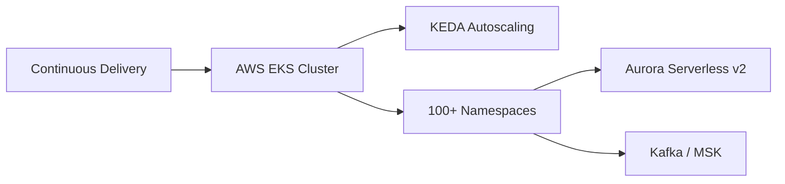

## Problem

TicketSocket operates a multi-tenant SaaS platform supporting high-demand ticketing operations and continuous software delivery. The work here is less about a single migration and more about continuously evolving a live platform: an AWS EKS cluster running hundreds of production workloads across 500+ Kubernetes deployments and 3 availability zones, with cloud-native data and messaging infrastructure underneath it — Aurora Serverless v2 and Kafka/MSK.

As the namespace count grew past 100, a cluster-wide resource quota overcommit had become invisible at the individual-namespace level: capacity allocation no longer matched real usage, which put both reliability and cost efficiency at risk.

## Constraints

- Workloads from many tenants share the same cluster capacity, so a fix couldn't just move the problem to a different namespace.
- This wasn't a one-time cutover — the platform needed to keep shipping continuously while the fix rolled out.
- The overcommit was only visible in aggregate, cluster-wide; the root cause required tracing it back to per-namespace allocation.
- A team of 3 engineers is responsible for hundreds of production workloads, which ruled out any fix that required manual, ongoing intervention.

## Decision

Event-driven autoscaling via KEDA was already in place to match workload demand, but the quota overcommit needed a structural fix, not a scaling tweak:

1. **Trace the overcommit to its source.** Aggregate resource requests across 100+ namespaces were audited against actual usage to find where allocation had drifted from reality.
2. **Right-size capacity allocation per namespace.** Requests and limits were recalculated per tenant workload instead of applying a blanket cluster-wide adjustment.
3. **Keep data and messaging infrastructure cloud-native.** Aurora Serverless v2 and Kafka/MSK stayed the backbone for multi-tenant data and event flow throughout, so the fix didn't require re-architecting the data layer.

### Trade-offs

Right-sizing per namespace took longer than an across-the-board capacity bump would have, but a blanket fix would have masked the same overcommit resurfacing as the platform kept growing — the per-namespace audit was what made the fix durable instead of temporary.

## Platform Footprint

A snapshot of one EKS cluster in this environment: 672 pods (669 running) across 542 deployments and 120 namespaces, spread over 17 nodes in 3 availability zones. Autoscaling runs through 36 KEDA ScaledObjects. Data and messaging sit on 4 Aurora Serverless v2 clusters (8 instances) and a 3-broker MSK cluster. Delivery runs through ArgoCD, and cluster metrics are collected with Victoria Metrics.

## Result

- Cluster-wide resource quota overcommit resolved, with capacity allocation right-sized across 100+ namespaces.
- Platform continues to run 500+ Kubernetes deployments across 3 availability zones without the reliability risk the overcommit had introduced.
- Cost efficiency improved as a direct result of allocation matching real usage instead of accumulated drift.

## Lessons Learned

Resource overcommit in a multi-tenant cluster is easy to miss because it's invisible in aggregate metrics — the cluster can look healthy while individual namespaces are already over-allocated. The fix that held was the one that traced the problem to its source per namespace, not the one that treated the symptom cluster-wide.
