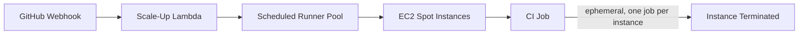

## Problem

GitHub-hosted runners hit both a cost ceiling and a concurrency ceiling as the organization's CI usage grew. At the same time, nothing was tracking or cleaning up the CI-side cost of that growth — GitHub Actions caches and old workflow runs accumulated across repositories with no automated cleanup, and a remote build-cache backend (Turbo) was leaking storage through incomplete multipart uploads.

## Constraints

- CI load is not flat: it peaks on weekday business hours and drops off nights and weekends, so a fixed-size runner fleet is either underprovisioned during peaks or wasteful the rest of the time.
- Ephemeral CI jobs need an isolated, fresh instance per job — a shared long-lived runner risks state leaking between unrelated builds.
- Runner infrastructure needed to serve both an org-wide external runner group and dedicated per-environment runners, from the same underlying Terraform module.
- No dedicated team owns cache and artifact hygiene across the organization's repositories, so cleanup had to be automatable and safe to run unattended.

## Decision

Self-hosted runners were built on the `philips-labs/terraform-aws-github-runner` module, with three deliberate customizations layered on top: schedule-aware pool sizing, spot instances for cost, and SSM instead of SSH for operational access.

### Schedule-aware pooling instead of a fixed fleet

Pool size is defined per cron schedule — weekday business hours, weekday off-hours, and weekends each get their own target pool size — instead of one static runner count. CI capacity follows actual demand instead of being sized for either the peak or the average.

### Spot instances for ephemeral, isolated jobs

Runners use `m5n.xlarge` spot instances with `enable_ephemeral_runners` behavior, so every job gets a fresh instance and spot pricing is acceptable precisely because no job depends on an instance surviving past its own run.

### SSM over SSH for runner access

Runners are reachable through AWS Systems Manager instead of exposing SSH, removing a class of network and key-management overhead from infrastructure that scales up and down constantly.

### Trade-offs

Spot instances introduce interruption risk that on-demand instances don't have, but that risk is acceptable specifically because runners are ephemeral — an interrupted spot instance just means one retried job, not a lost long-running process.

## Result

- Runner capacity scales with actual weekday/weekend CI demand instead of a fixed fleet size.
- Ephemeral, spot-backed instances reduced both cost and the operational surface area of long-lived runner infrastructure.
- Added GitHub Actions cache cleanup and stale workflow-run auditing scripts, plus S3 multipart-upload cleanup for the Turbo remote build cache, closing a storage-cost leak that had no other owner.

## Lessons Learned

Most of the cost and reliability problems in CI infrastructure aren't about the runners themselves — they're about the artifacts CI produces (caches, build outputs, old runs) that nobody owns by default. Schedule-aware pooling solved the runner-cost problem; the cleanup automation solved the artifact-cost problem, and both were necessary.
