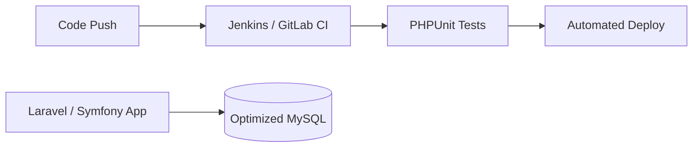

## Problem

The platform's traffic had outgrown its original architecture. Pages were slow under load, integrations with third-party services were fragile, and releases were manual enough that shipping a fix carried real risk of introducing a new one.

## Constraints

- Optimization work had to happen against live production traffic — there was no equivalent staging environment at full scale.
- Existing integrations (payment gateways, analytics) could not be broken during the rework.
- Automated testing was minimal at the outset, so quality had to be built in as part of the same effort.

## Decision

The work was split into three parallel tracks: query optimization, API standardization, and CI/CD automation.

Slow MySQL queries were identified and rewritten with proper indexing and query restructuring. REST APIs were standardized across Laravel and Symfony services to make third-party integrations more predictable. PHPUnit test coverage was added incrementally, focused on the checkout and integration paths most likely to break silently.

### Trade-offs

Optimizing against live traffic instead of a synthetic benchmark environment was riskier, but it meant every improvement was validated against real usage patterns rather than assumptions.

## Result

- **50% reduction** in page load times from query optimization and indexing.
- **40% improvement** in data-exchange efficiency across third-party integrations.
- **30% faster release cycles** after introducing Jenkins/GitLab CI/CD pipelines in place of manual deploys.

## Lessons Learned

Performance work on a live system has to be incremental and measured — each MySQL optimization was validated independently rather than bundled into one large change. Automating the release path turned out to matter as much for confidence as for speed: a 30% faster pipeline mattered less than the fact that every release now ran the same tests, every time.
