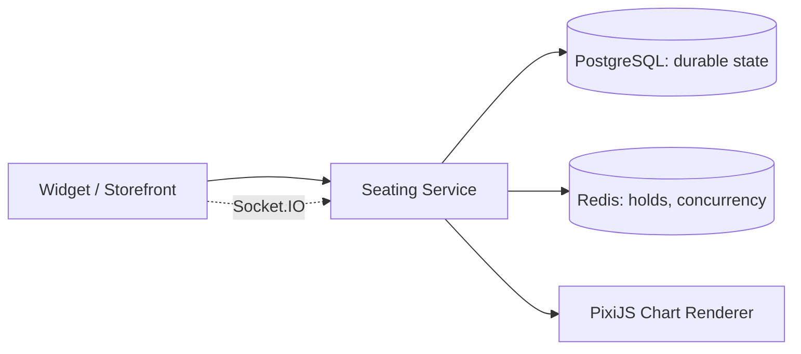

## Problem

The platform's seating experience — browser chart rendering, chart design tooling, event and inventory lifecycle, availability, holds, releases, season events, reporting, and workspace administration — is built entirely on a third-party vendor SDK and CDN-loaded renderer. That dependency reaches deep into the platform: the storefront, box office, customer accounts, buyer-facing widgets, and an internal message-producer flow all call into it directly or through a service-level wrapper.

Replacing it is not a rip-and-replace problem. A brainstorming pass on the full replacement scope — responsive rendering, seat concurrency, general admission and seated inventory, bidirectional communication, hold timeouts, large venues (up to roughly 150,000 objects), map imports, chart designer, season events, and multi-venue support — made clear that no single phase could deliver all of it safely.

## Constraints

- Every existing caller — storefront, box office, customer accounts, widget entry points, message-producer flows — needs to keep working through internal contracts rather than being rewritten around a new domain model.
- The full replacement scope is deliberately larger than any first delivery phase can cover.
- Seat concurrency correctness is a revenue-critical constraint: a regression in availability, holding, releasing, or booking can directly cause oversells or blocked inventory.
- Redis is a volatile coordination layer by design, so every hold, release, booking, and expiration flow has to produce enough durable state in Postgres to rebuild Redis from scratch if it's lost.

## Decision

Build the seating capability as an internally-owned service behind the same integration boundary the platform already has, and roll it out in phases ordered by risk rather than by feature completeness.

### Postgres as source of truth, Redis as coordination only

Durable venue, chart, event, section, seat, ticket, and inventory state lives in Postgres. Redis holds short-lived seat holds and availability counters for low-latency selection — and the service must be able to fully rebuild that Redis state from Postgres, so Redis loss is an inconvenience, not a data-loss event.

### Phase 1 starts at general admission, not seated maps

The first delivery phase deliberately targets GA inventory and small venues rather than seated charts — GA validates inventory, holds, automatic release, and storefront integration without requiring the harder problem of a full seat-object renderer first. Seated venues, chart designer parity, and season events are explicitly out of scope until GA is proven.

### PixiJS and Socket.IO chosen for rendering and real-time sync

PixiJS was chosen for the custom chart renderer specifically for rendering performance at the venue sizes the platform needs to support. Socket.IO handles bidirectional updates between clients and seating state for concurrent seat selection.

### Trade-offs

Preserving the existing integration boundary through adapters is slower than designing a clean new domain model from scratch, but it's what keeps the storefront, box office, and widget teams unblocked — they migrate from vendor SDK concepts to internal DTOs, not from an old domain model to an entirely new one.

## Current Status

This architecture is proposed and in active design, not yet fully rolled out. Phase 1 (general admission, single events) is the delivery target; seated venues, season events, and full chart-designer parity are later milestones gated on Phase 1 proving out inventory, concurrency, and hold-release correctness in production.

## Lessons Learned

Sequencing a vendor replacement by risk — GA before seated maps, single events before season events — matters more than sequencing by how much of the vendor's feature surface gets replaced first. The riskiest part of this system isn't the renderer, it's concurrency correctness under real buyer load, so that's the part the rollout plan protects first.
