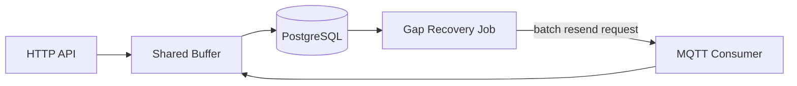

## Problem

A distributed sensor network needed a backend that could ingest telemetry from both HTTP clients and MQTT-connected gateways simultaneously, track fleet health across devices with unreliable connectivity, and correlate sensor readings with physical floor plans — without silently losing data when a gateway's uplink dropped frames.

## Constraints

- Telemetry arrives over two independent transports (HTTP API and MQTT) that both need to land in the same data model.
- Frame loss can happen at two different points — RF loss between the sensor node and the gateway, or uplink loss between the gateway and the backend — and only one of those is recoverable after the fact.
- Floor-plan uploads are user-supplied SVG files, which meant treating every upload as untrusted input.
- Asset position edits come from a live drag-and-drop UI that can race with real-time position updates from the field.

## Decision

The system separates concerns across five PostgreSQL schemas (`core`, `telemetry`, `monitoring`, `raw`, `spatial`) and buffers incoming measurements — flushing every 2 seconds or after 100 payloads, whichever comes first — while gateway heartbeats bypass the buffer entirely and insert directly.

### Two independent sequence counters

`node_seq` tracks RF transmission from node to gateway; `gw_seq` tracks uplink delivery from gateway to backend. Only gaps in `gw_seq` are recoverable — RF loss between node and gateway never reached the gateway's log in the first place, so there's nothing to resend.

### Batched gap recovery, not per-sequence requests

A self-healing job detects gaps in `gw_seq`, and asks the gateway to resend exactly those sequence numbers in a single batch (`read seqs:[...]` over MQTT) rather than one request per missing sequence. Requesting sequences individually caused each read to scan the gateway's full on-device log and produced collision errors — batching kept requests aligned with the domain model instead of fighting firmware constraints.

### Untrusted SVG uploads treated as a security boundary

Floor-plan uploads go through multi-stage validation: file type detected by magic bytes rather than extension, oversized rasters rejected before loading, an element allowlist strips `<script>` and `<foreignObject>` tags and malicious attributes, external hrefs are stripped, and path traversal is blocked. Only the normalized output is ever stored — the original upload is discarded.

### Optimistic locking instead of last-write-wins

Asset position updates require an `expected_version` parameter; a mismatch returns `409 Conflict`. This is what keeps drag-and-drop UI edits from silently overwriting live position updates arriving from the field at the same time.

### Denormalized spatial snapshots instead of per-request joins

A periodic job recomputes a denormalized snapshot table every 60 seconds, using a single `DISTINCT ON` pass to grab the latest measurement and status per device — trading a small staleness window for avoiding expensive joins on every dashboard request.

### Trade-offs

Buffering measurements before writing them trades a small window of in-memory risk for a large reduction in write load — acceptable because gateway heartbeats, which are the events that most need to land immediately, bypass the buffer entirely.

## Result

- Telemetry ingestion runs reliably across two independent transports without duplicating the data model per transport.
- Uplink gaps are detected and recovered automatically instead of surfacing as silent data loss.
- Floor-plan uploads are handled as untrusted input by default, with no original file ever persisted.
- Firmware OTA rollouts are tracked through explicit states (pending → sent → success/failed) instead of fire-and-forget deployment.

## Lessons Learned

Modeling RF loss and uplink loss as two separate, independently trackable failure modes — rather than one generic "missing data" bucket — was what made automatic recovery possible at all. A system that only tracked "data is missing" would have had no way to know whether resending a sequence number could ever succeed.
