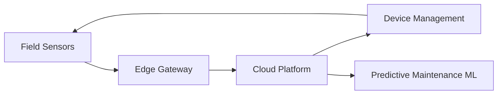

## Problem

City infrastructure — traffic signals, waste-management systems, environmental sensors — needed real-time monitoring and predictive maintenance, but the devices were physically distributed, connectivity was inconsistent, and no central system existed to manage them as a fleet rather than as individual installations.

## Constraints

- Devices were spread across many physical locations with intermittent connectivity, ruling out designs that assumed constant uptime.
- Public infrastructure meant security requirements — encryption, authentication, secure boot — were non-negotiable from day one.
- The architecture team was two engineers, so the device-management layer had to be centralized and largely self-service rather than operated by hand.

## Decision

The platform was built around edge computing so that devices could make local decisions and buffer data during connectivity gaps, combined with a centralized device-management layer for fleet-wide visibility and control.

Security was designed in rather than added later: every device authenticated with unique credentials, all traffic was encrypted end-to-end, and secure boot prevented tampered firmware from joining the fleet.

### Trade-offs

Centralizing device management added upfront complexity compared to treating each site as a one-off deployment, but it was the only way two engineers could operate 50,000+ devices without the fleet becoming unmanageable as it grew.

## Result

- **50,000+ IoT devices** brought under centralized management across multiple locations.
- Improved device uptime and operational efficiency from proactive, fleet-wide visibility instead of reactive, per-site troubleshooting.
- A reusable IoT security framework — encryption, device authentication, secure boot — that carried forward into later projects, including the telemetry ingestion pipeline built on top of this platform.

## Lessons Learned

Designing for intermittent connectivity from the start is far cheaper than retrofitting it later. Edge computing wasn't just a performance optimization here — it was what made the platform operable at all, given the realities of public infrastructure networking.
