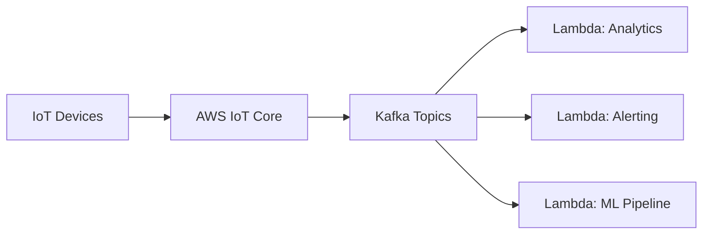

## Problem

Once the smart-city IoT platform had devices reporting telemetry at scale, the next problem was ingestion: turning that stream into something analytics and predictive-maintenance systems could consume in real time, without the ingestion layer becoming a bottleneck or a single point of failure.

## Constraints

- Device traffic was bursty — a citywide event or weather change could spike volume from thousands of sensors simultaneously.
- Downstream consumers (analytics dashboards, ML models) needed to evolve independently, without redeploying the ingestion layer every time.
- Data loss during traffic spikes was not acceptable — telemetry gaps directly undermined the platform's value.

## Decision

Apache Kafka was chosen as the backbone to decouple ingestion from processing: devices publish through AWS IoT Core, which routes into Kafka topics, and AWS Lambda functions consume from those topics independently for each downstream use case.

This meant a new downstream consumer could subscribe to the existing Kafka topics without any change to the ingestion path — and a slow or failing consumer couldn't back-pressure the devices publishing data.

### Trade-offs

Running Kafka added operational surface area compared to a simpler queue, but the ability to replay and independently scale multiple downstream consumers was worth the extra complexity at this device count.

## Result

- Real-time analytics and predictive maintenance running on live telemetry from 50,000+ devices.
- Ingestion and downstream processing evolved independently — new consumers were added without touching the ingestion path.
- Consistent throughput maintained through traffic bursts that would have overwhelmed a simpler point-to-point integration.

## Lessons Learned

Decoupling ingestion from processing early is what made the platform extensible. The cost of introducing Kafka was paid back the first time a new analytics use case shipped without a single change to how devices published data.
